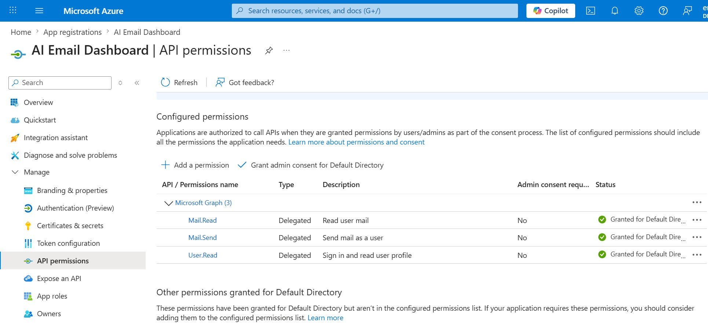
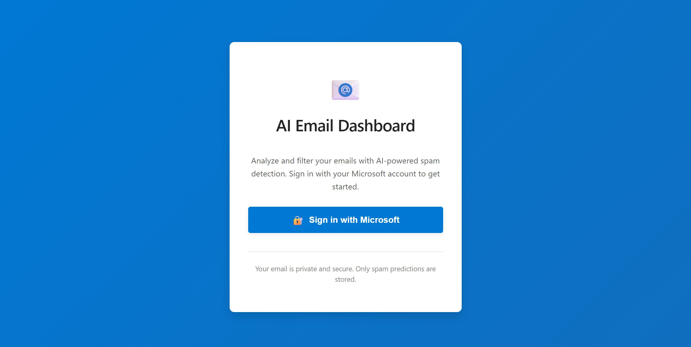
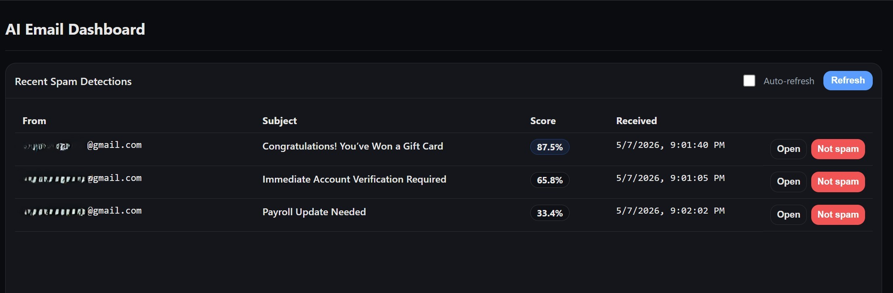
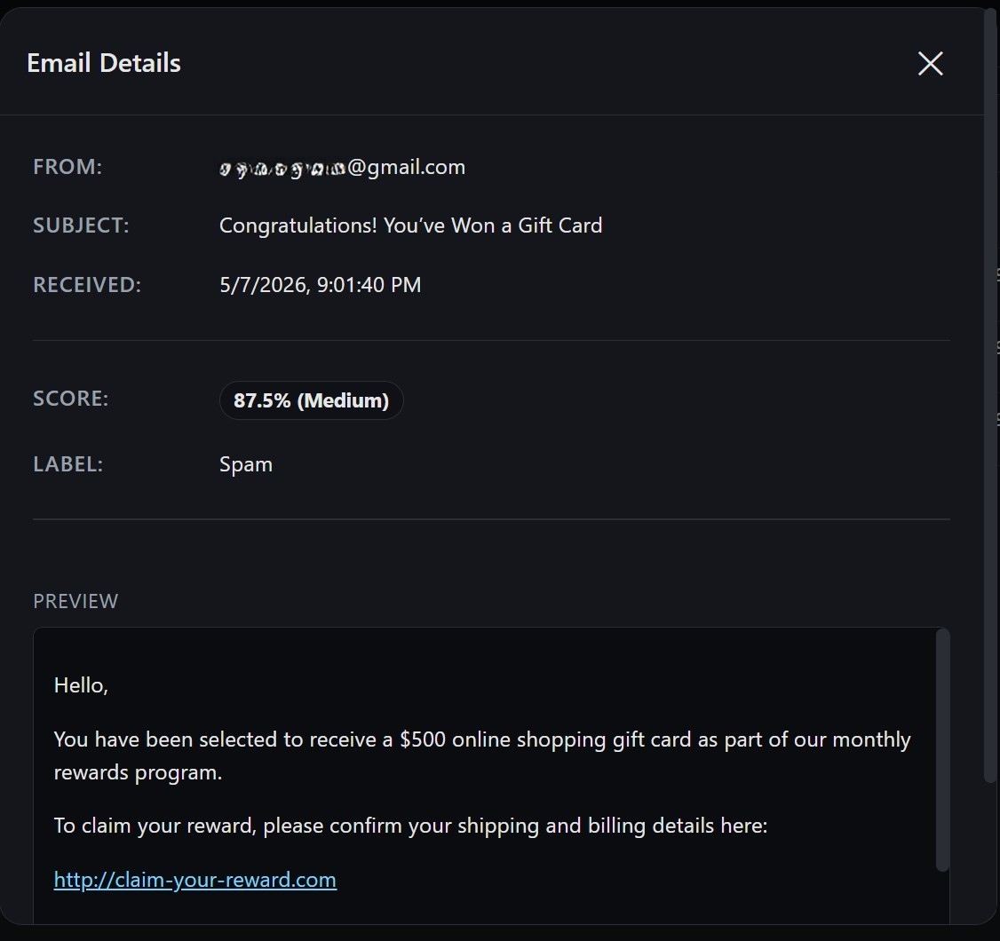

# AI Email Dashboard

A full-stack AI email dashboard that connects to Microsoft Outlook using Microsoft Graph API and helps analyze and identify potential spam emails.

Users can sign in with Microsoft OAuth, fetch their Outlook emails, view spam prediction scores, inspect email content, and dismiss false-positive results from the dashboard.

---


## Features

- Microsoft OAuth authentication using Azure App Registration
- Outlook email integration using Microsoft Graph API
- AI-based spam detection using TensorFlow/Keras
- Real email retrieval and spam probability scoring
- Interactive dashboard for viewing and analyzing emails
- Email preview modal with rendered Outlook email content

---

## Microsoft Graph & Azure Integration

This project integrates with Microsoft Outlook through Microsoft Graph API and Microsoft Entra ID.

The authentication and email access flow uses:

- Azure App Registration
- OAuth 2.0 Authorization Code Flow
- MSAL for token handling
- Microsoft Graph delegated permissions

Configured Microsoft Graph permissions:

- `Mail.Read`
- `User.Read`

After the user signs in, the backend uses Microsoft Graph to retrieve Outlook emails, passes the email content through the spam detection model, and returns the results to the React dashboard.

### Azure App Registration




---

## Screenshots

### Login Page


### Dashboard


### Email Details Modal


---

## Tech Stack

### Frontend
- React
- TypeScript
- CSS

### Backend
- Django
- Django REST Framework
- Microsoft Graph SDK
- MSAL

### Machine Learning
- TensorFlow
- Keras

---

## Project Structure

```txt
AI-Email-Dashboard/
├── backend/
│   ├── email_ai/
│   │   ├── ai/                   # Spam detection and prediction logic
│   │   ├── microsoft_graph/      # Microsoft Graph authentication and email retrieval
│   │   ├── views.py              # API endpoints
│   │   └── urls.py
│   │
│   ├── smart_email/              # Django project configuration
│   ├── manage.py
│   └── requirements.txt
│
├── frontend/
│   ├── src/
│   │   ├── components/
│   │   │   └── EmailSpamDashboard.tsx # Dashboard, refresh logic, email modal, Not Spam action
│   │   ├── pages/
│   │   │   └── MicrosoftLogin.tsx     # Microsoft OAuth sign-in page
│   │   └── styles/                    # Dashboard and login styling
│   │
│   └── package.json

```

---


## Getting Started

### Clone the repository

```bash
git clone https://github.com/ErynVarghese/AI-Email-Dashboard.git
cd AI-Email-Dashboard
```

---

## Backend Setup

```bash
cd backend
pip install -r requirements.txt
```

Create a `.env` file inside the `backend` directory. You can use `.env.example` as a reference.


Run the backend:

```bash
python manage.py runserver
```

Backend runs on:

```txt
http://localhost:8000
```

---

## Frontend Setup

```bash
cd frontend
npm install
npm start
```

Frontend runs on:

```txt
http://localhost:3000
```

---

## How It Works

1. User signs in with Microsoft OAuth
2. The backend receives the OAuth callback and handles token access
3. Outlook emails are retrieved through Microsoft Graph API
4. Email content is passed through the spam detection model
5. The dashboard displays spam scores and email details
6. Users can dismiss false positives using “Not Spam”

---

## Future Improvements

- Use “Not Spam” feedback to improve and retrain the spam detection model over time
- Add more dashboard widgets and email analytics
- Add support for moving emails between Inbox and Junk using Microsoft Graph API

